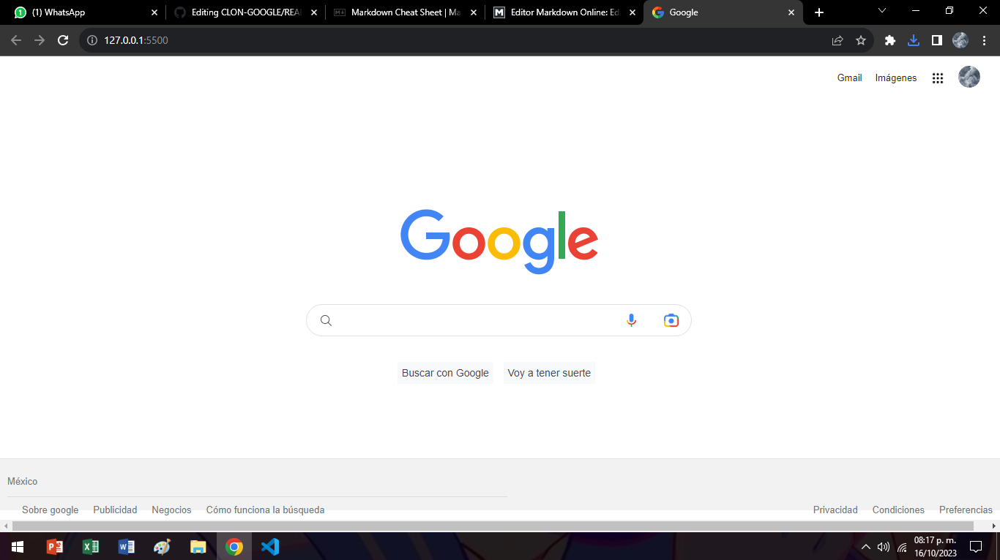

# CLON-GOOGLE
Proyecto Creado en **Tecnolochicas PRO**, simulando la página principal del navegador de google.
***
Poniendo en práctica lo aprendido en el bootcamp logré realizr un clon del explorador de google.
## 1. Intro
El proyecto fue creado con **HTML** y **CSS**. Se trata del navegador más usado (Google).
* Puedes visitar el sitio en el siguiente enlace: 

** Inspírate de la realización de este proyecto, utiliza tu destreza y aprendizaje para demostrar que tu futuro es ser desarrolladora frontend**
## Contenido del proyecto:
1. Header:
Esta sección muestra el menú y foto de perfil.
2. Main:
Cuontiene los elementos centrales del buscador.
3. Footer:
Incluye hipervínculos al final de la página.
***
Realizado por: Karen Caballero Hernández.
